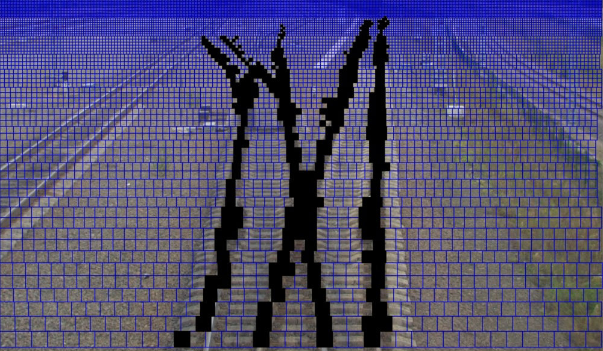
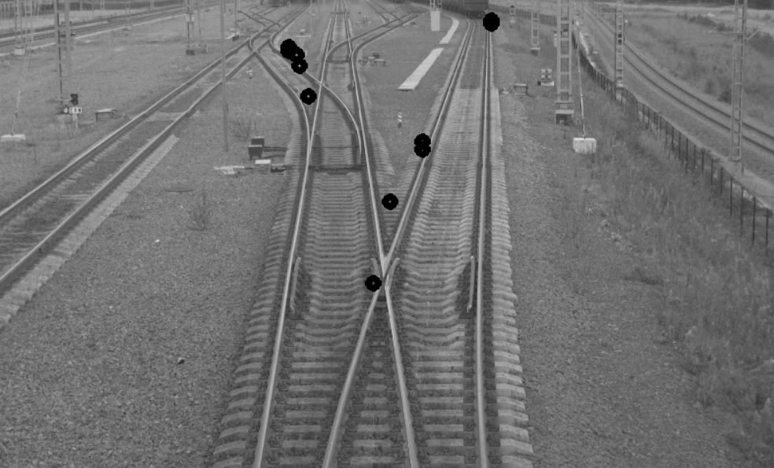
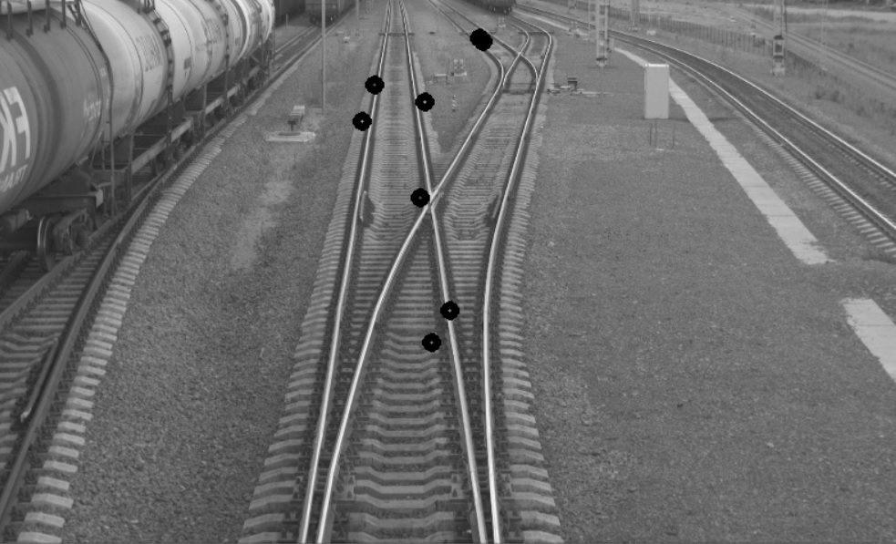

# Поставнока задачи  
На вход подается изображение — фотография сделанная с головы поезда. 
Необходимо найти на входном изображении места пересечений железно-дорожных путей. Пересечением будем называть точку, в которой пересекаются рельсы одной ж/д колеи с другой.
На выходе алгоритма должен быть набор точек, в которых было обнаружено пересечение.
 
Замечания: 
Нет задачи максимально точно определить место пересечения, то есть алгоритм находит примерное место пересечения. Предварительно можно сказать, что с точностью некоторой окрестности 50 на 50 пикселей(эти цифры могут поменяться в процессе решения).
Нет задачи искать пересечения, которые находятся на заднем плане снимка. Главное правильно находить все пересечения в пределах 20-30 метров перед поездом. 
Нет ограничений на условия съёмки. Съёмка может проводиться как при дневном свете, так и при искусственном(фонари ночью, такие примеры есть в датасете).
#  Установка  
you need to install opencv library for correct compilation  
look at opencv install tutorial for visual studio https://www.deciphertechnic.com/install-opencv-with-visual-studio/  
Также в секции project->properties->preprocessor_definitions надо указать: _CRT_SECURE_NO_WARNINGS для корректной компиляции  
#  Program input: path_to_image  
#  Program output:  
image with intersection points and image with detected rails  
#  Dataset:  
Images on which you can test my program stores in foldet: data/  

#  Алгоритм  
* Преобразуем изображение d черно-белые тона.  
* С помощью оператора Собеля находим карту градиентов изображения - величина и направление градиента в каждой точке.  
* Составляем 8 интегральных изображений для каждого из направлений градиента - это нужно для быстрого подсчете HOG(гистограммы ориентированных градиентов) в любом прямоугольнике изображения(https://www.researchgate.net/publication/315454767_A_Fast_HOG_Descriptor_Using_Lookup_Table_and_Integral_Image)  
* Строим сетку на изображении. Цель построения сетки - на каждом из уровней высоты разбить исходное изображение на квадратики размером, соизмеримым с размером кусочка рельса на данной высоте. То есть в нижней строчке изображения (ближе к камере) разбиение будет крупным, и будет уменьшаться по мере приближения к верхней точке изображения:  
.  
* Поиск рельсов на полученной сетке. Для поиска рельсов используется алгоритм growing_up:  
1. Для каждой клетки из нижней строки сетки, пытаемся пойти вверх в центрального, правого или левого соседа. Сосед считается рельсом, если хи-квадрат оценка для гистограммы HOG соседа и гистограммы HOG текущей точки < treashhold = 1.5(подобран экспериментально). Также с помощью HOG соседа проверяется, есть ли вертикальные ребра у этого соседа, если их нет - игнорируем данную клетку. Также если наоброт, есть горизонтальные ребра - игнорируем данную клетку.
2. Таким образом, рекурсивно для каждого вновь появившегося соседа ищутся его соседи, в которых может находиться рельс.  
3. В итоге на выходе из алгоритма имеется набор возрастающих по 'y' наборов клеток, которые и являются рельсами.  
* Поиск пересечений рельсов  
Начиная с первой строки сетки считаем количество рельсов, находящихся в данном строке. Так как иногда один рельс может отражаться двумя и более горизонтальными клетками в строке - такие подряд идущие клетки заменяются одной средней из них.  
Далее, по такой же схеме считаем количество рельсов в следующей строке. И если количество рельсов в текущей и предыдщей строках различное - значит в текущей строке есть пересечение. Это может быть как переход от большего к меньшему количеству рельсов в строке - двe пары рельсов сходятся. Так и переход от меньшего к большему количеству рельсов в строке - отделение пути от текущего пути.  
#  Проблемы алгоритма  
Сейчас разбиение сетки происходит линейно в зависимости от высоты, но по факту перспектива камеры работает нелинейно и нужно придумать более правдоподобное перспективное преобразование для разбиения изображения на сетку. Именно из-за этой проблемы количество клеток на рельс вверху изображения намного больше, чем количество клеток на рельс внизу изображения - это является большой проблемой и ограничивает пространство для выбора алгоритма поиск самих пересечений рельсов.  
Вообще разбиение на сетку является краеугольными камнем в данном алгоритме, если правильно это сделать, то результаты сильно улучшатся.

# Примеры работы  
  
  
